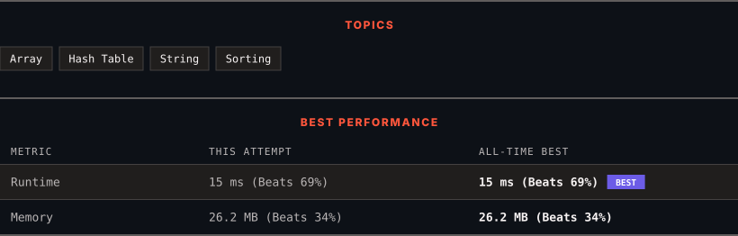

# 49. Group Anagrams

      

---

<picture>
  <source media="(prefers-color-scheme: dark)" srcset="panel-dark.svg">
  <source media="(prefers-color-scheme: light)" srcset="panel-light.svg">
  
</picture>

> **New personal best** — Runtime improved on this submission.

### HOW IT WENT

| | |
|:--|:--|
| **Attempts** | first try |
| **Time to solve** | under a minute |
| **Verdicts** | ✅ Accepted |

---

### NOTES

_No notes yet._

---

### SOLUTIONS (1)

| # | File | Language | Date |
|:-:|------|:--------:|:----:|
| 1 | [sol1.cpp](./sol1.cpp) | `C++` | 2026-09-28 ← **latest** |

---

### PROBLEM DESCRIPTION

Given an array of strings `strs`, group the anagrams together. You can return the answer in **any order**.

 

**Example 1:**

**Input:** strs = ["eat","tea","tan","ate","nat","bat"]

**Output:** [["bat"],["nat","tan"],["ate","eat","tea"]]

**Explanation:**

	- There is no string in strs that can be rearranged to form `"bat"`.

	- The strings `"nat"` and `"tan"` are anagrams as they can be rearranged to form each other.

	- The strings `"ate"`, `"eat"`, and `"tea"` are anagrams as they can be rearranged to form each other.

**Example 2:**

**Input:** strs = [""]

**Output:** [[""]]

**Example 3:**

**Input:** strs = ["a"]

**Output:** [["a"]]

 

**Constraints:**

	- `1 <= strs.length <= 10^4`

	- `0 <= strs[i].length <= 100`

	- `strs[i]` consists of lowercase English letters.

---

Auto-synced by <strong>LeetSync</strong> · Built by <a href="https://deveshsamant.in/">Devesh Samant</a>

