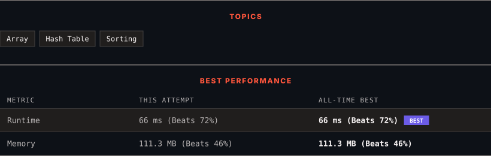

# 217. Contains Duplicate

      

---

<picture>
  <source media="(prefers-color-scheme: dark)" srcset="panel-dark.svg">
  <source media="(prefers-color-scheme: light)" srcset="panel-light.svg">
  
</picture>

> **New personal best** — Runtime improved on this submission.

### HOW IT WENT

| | |
|:--|:--|
| **Attempts** | 2 before accepted |
| **Time to solve** | 18 min |
| **Verdicts** | ✅ Accepted → ✅ Accepted |

---

### NOTES

_No notes yet._

---

### SOLUTIONS (2)

| # | File | Language | Date |
|:-:|------|:--------:|:----:|
| 1 | [sol1.cpp](./sol1.cpp) | `C++` | 2026-09-25 |
| 2 | [sol2.cpp](./sol2.cpp) | `C++` | 2026-09-25 ← **latest** |

---

### PROBLEM DESCRIPTION

Given an integer array `nums`, return `true` if any value appears **at least twice** in the array, and return `false` if every element is distinct.

 

**Example 1:**

**Input:** nums = [1,2,3,1]

**Output:** true

**Explanation:**

The element 1 occurs at the indices 0 and 3.

**Example 2:**

**Input:** nums = [1,2,3,4]

**Output:** false

**Explanation:**

All elements are distinct.

**Example 3:**

**Input:** nums = [1,1,1,3,3,4,3,2,4,2]

**Output:** true

 

**Constraints:**

	- `1 <= nums.length <= 10^5`

	- `-10^9 <= nums[i] <= 10^9`

---

Auto-synced by <strong>LeetSync</strong> · Built by <a href="https://deveshsamant.in/">Devesh Samant</a>

