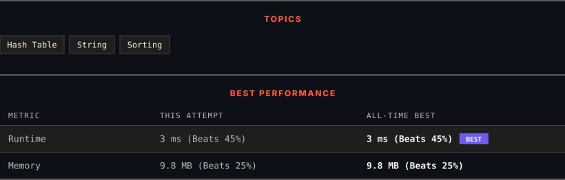

# 242. Valid Anagram

      

---

<picture>
  <source media="(prefers-color-scheme: dark)" srcset="panel-dark.svg">
  <source media="(prefers-color-scheme: light)" srcset="panel-light.svg">
  
</picture>

> **New personal best** — Runtime improved on this submission.

### HOW IT WENT

| | |
|:--|:--|
| **Attempts** | first try |
| **Time to solve** | under a minute |
| **Verdicts** | ✅ Accepted |

---

### NOTES

_No notes yet._

---

### SOLUTIONS (1)

| # | File | Language | Date |
|:-:|------|:--------:|:----:|
| 1 | [sol1.cpp](./sol1.cpp) | `C++` | 2026-09-27 ← **latest** |

---

### PROBLEM DESCRIPTION

Given two strings `s` and `t`, return `true` if `t` is an anagram of `s`, and `false` otherwise.

 

**Example 1:**

**Input:** s = "anagram", t = "nagaram"

**Output:** true

**Example 2:**

**Input:** s = "rat", t = "car"

**Output:** false

 

**Constraints:**

	- `1 <= s.length, t.length <= 5 * 10^4`

	- `s` and `t` consist of lowercase English letters.

 

**Follow up:** What if the inputs contain Unicode characters? How would you adapt your solution to such a case?

---

Auto-synced by <strong>LeetSync</strong> · Built by <a href="https://deveshsamant.in/">Devesh Samant</a>

