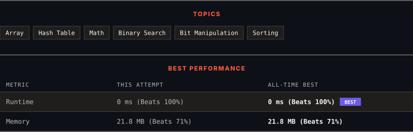

# 268. Missing Number

      

---

<picture>
  <source media="(prefers-color-scheme: dark)" srcset="panel-dark.svg">
  <source media="(prefers-color-scheme: light)" srcset="panel-light.svg">
  
</picture>

> **New personal best** — Runtime improved on this submission.

### HOW IT WENT

| | |
|:--|:--|
| **Attempts** | first try |
| **Time to solve** | 1 min |
| **Verdicts** | ✅ Accepted |

---

### NOTES

_No notes yet._

---

### SOLUTIONS (1)

| # | File | Language | Date |
|:-:|------|:--------:|:----:|
| 1 | [sol1.cpp](./sol1.cpp) | `C++` | 2026-09-24 ← **latest** |

---

### PROBLEM DESCRIPTION

Given an array `nums` containing `n` distinct numbers in the range `[0, n]`, return *the only number in the range that is missing from the array.*

 

**Example 1:**

**Input:** nums = [3,0,1]

**Output:** 2

**Explanation:**

`n = 3` since there are 3 numbers, so all numbers are in the range `[0,3]`. 2 is the missing number in the range since it does not appear in `nums`.

**Example 2:**

**Input:** nums = [0,1]

**Output:** 2

**Explanation:**

`n = 2` since there are 2 numbers, so all numbers are in the range `[0,2]`. 2 is the missing number in the range since it does not appear in `nums`.

**Example 3:**

**Input:** nums = [9,6,4,2,3,5,7,0,1]

**Output:** 8

**Explanation:**

`n = 9` since there are 9 numbers, so all numbers are in the range `[0,9]`. 8 is the missing number in the range since it does not appear in `nums`.

 

 

 

 

 

**Constraints:**

	- `n == nums.length`

	- `1 <= n <= 10^4`

	- `0 <= nums[i] <= n`

	- All the numbers of `nums` are **unique**.

 

**Follow up:** Could you implement a solution using only `O(1)` extra space complexity and `O(n)` runtime complexity?

---

Auto-synced by <strong>LeetSync</strong> · Built by <a href="https://deveshsamant.in/">Devesh Samant</a>

