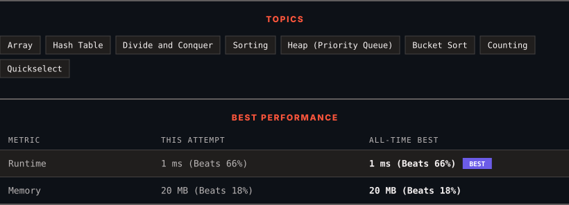

# 347. Top K Frequent Elements

      

---

<picture>
  <source media="(prefers-color-scheme: dark)" srcset="panel-dark.svg">
  <source media="(prefers-color-scheme: light)" srcset="panel-light.svg">
  
</picture>

> **New personal best** — Runtime improved on this submission.

### HOW IT WENT

| | |
|:--|:--|
| **Attempts** | first try |
| **Time to solve** | under a minute |
| **Verdicts** | ✅ Accepted |

---

### NOTES

_No notes yet._

---

### SOLUTIONS (2)

| # | File | Language | Date |
|:-:|------|:--------:|:----:|
| 1 | [sol1.cpp](./sol1.cpp) | `C++` | 2026-09-30 |
| 2 | [sol2.cpp](./sol2.cpp) | `C++` | 2026-09-30 ← **latest** |

---

### PROBLEM DESCRIPTION

Given an integer array `nums` and an integer `k`, return *the* `k` *most frequent elements*. You may return the answer in **any order**.

 

**Example 1:**

**Input:** nums = [1,1,1,2,2,3], k = 2

**Output:** [1,2]

**Example 2:**

**Input:** nums = [1], k = 1

**Output:** [1]

**Example 3:**

**Input:** nums = [1,2,1,2,1,2,3,1,3,2], k = 2

**Output:** [1,2]

 

**Constraints:**

	- `1 <= nums.length <= 10^5`

	- `-10^4 <= nums[i] <= 10^4`

	- `k` is in the range `[1, the number of unique elements in the array]`.

	- It is **guaranteed** that the answer is **unique**.

 

**Follow up:** Your algorithm's time complexity must be better than `O(n log n)`, where n is the array's size.

---

Auto-synced by <strong>LeetSync</strong> · Built by <a href="https://deveshsamant.in/">Devesh Samant</a>

